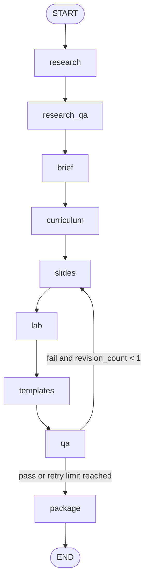

# Training Factory  
## Deterministic, Governance-Grounded Technical Training Generation

Training Factory is a governance-first system for generating structured technical training assets from a single input request (**topic** + **audience**).

Unlike generic LLM pipelines, Training Factory emphasizes:

- Deterministic behavior  
- Authority-tiered research grounding  
- Product-aware retrieval  
- Bounded retry logic  
- Schema-validated outputs  
- Reproducible evaluation across research modes  

The system produces a validated training bundle with:

- Brief  
- Curriculum  
- Slides  
- Lab  
- Templates (`README` + `RUNBOOK`)  
- QA report  
- Source provenance  

All artifacts are structured, schema-validated JSON, making outputs predictable, testable, and automation-ready.

---

## Why This Project Exists

Most AI-generated training content suffers from:

- Unverifiable sourcing  
- Inconsistent structure  
- Opaque retry behavior  
- Unbounded hallucination risk  
- Non-reproducible outputs  

Training Factory was built to explore a different approach:

> What if training generation behaved more like a governed system than a prompt experiment?

The result is a multi-agent pipeline with deterministic ranking, authority enforcement, and explicit lifecycle validation.

---

## Core Capabilities

### 1) Authority-Tiered Research Layer

The research stage ranks sources deterministically using:

- Authority tiers (A/B/C/D)
- Keyword overlap scoring
- Product-aware anchor queries
- Preferred-domain boosts
- Domain diversity constraints
- Sensitive-topic enforcement (e.g., Tier A requirement for sensitive topics)

No embeddings.  
No vector database.  
Fully explainable ranking.

---

### 2) Multi-Mode Research Architecture

The system supports three deterministic research modes:

| Mode | CLI Flags | Behavior |
|------|-----------|----------|
| **M1** | `--offline` | Deterministic curated sources only |
| **M2** | `--web --search-provider fallback` | Controlled web recall |
| **M3** | `--web --search-provider serpapi` | Expanded web recall with authority diversity |

This enables reproducible comparisons across research depth and authority diversity.

---

### 3) LangGraph-Orchestrated Generation

Pipeline order: `research → research_qa → brief → curriculum → slides → lab → templates → qa → package`

Retry rules are bounded and deterministic:

- `research_qa` retries once if authority/coverage thresholds fail
- `qa` retries once from `slides` if validation fails
- No unbounded loops



### 4) Governance & QA Enforcement

Validation checks include:

- Minimum source count
- Authority-tier threshold compliance
- Keyword coverage ratio
- Domain concentration limits
- Citation propagation integrity
- Schema validation on all artifacts

Sensitive topics require Tier A authority (e.g., NIST).

### 5) Evaluation Harness

Training Factory includes a lightweight evaluation framework:
- Runs test cases across M1/M2/M3
- Captures:
  - Tier counts
  - Domain diversity
  - Keyword coverage
  - QA status
  - Retry events
- Produces structured CSV comparison outputs

This makes research-mode behavior measurable and reproducible.

## Streamlit Governance GUI

Launch the GUI:
```bash
streamlit run apps/training_factory_gui/app.py
```

Capabilities:

- Topic / audience / mode selection
- Deterministic CLI execution
- Mode-scoped outputs (out_dir/<MODE>/bundle.json)
- Run history + manifests
- Log inspection
- Bundle viewer
- Mode comparison panel

The GUI exposes system behavior transparently without hiding CLI execution.

## CLI Usage

Generate a bundle (M1 offline):
```bash
python -m training_factory.cli generate \
  --topic "Power BI basics" \
  --audience novice \
  --out out/eval/phase_a/C1/M1/bundle.json \
  --offline
```

M2 (web + fallback):
```bash
python -m training_factory.cli generate \
  --topic "Power BI basics" \
  --audience novice \
  --out out/eval/phase_a/C1/M2/bundle.json \
  --web --search-provider fallback
```

M3 (web + serpapi):
```bash
python -m training_factory.cli generate \
  --topic "Power BI basics" \
  --audience novice \
  --out out/eval/phase_a/C1/M3/bundle.json \
  --web --search-provider serpapi
```

Write to a specific output path:
```bash
--out out/eval/phase_a/C1/M3/bundle.json
```
## Determinism & Testing Guarantees

Run tests:
```bash
pytest -q
```
Key guarantees:

- Offline deterministic execution path for tests (no network dependency)
- No live model call requirement for tests
- Schema validation on final bundles
- Stable routing assertions
- Structured output contracts
- Output Contract

## Output Contract

Each packaged bundle includes:

```JSON
{
  "request": {},
  "research": {},
  "brief": {},
  "curriculum": {},
  "slides": {},
  "lab": {},
  "templates": {},
  "qa": {}
}
```
Templates are canonicalized as:
```JSON
{
  "readme_md": { "content": "..." },
  "runbook_md": { "content": "..." }
}
```
All artifacts are JSON schema validated.

## Repository Layout

```code
training-factory/
├─ src/training_factory/
│  ├─ agents/
│  ├─ research/
│  ├─ graph.py
│  ├─ state.py
│  ├─ cli.py
│  └─ utils/
├─ schemas/
├─ tests/
├─ apps/
│  └─ training_factory_gui/
└─ out/
```

## Technical Deep Dive (For Engineers)

Research Layer

- SearchProvider protocol abstraction
- Deterministic scoring model
- Authority-tier weighting
- Product detection (_detect_product)
- Anchor queries for Microsoft/enterprise tools
- Diversity rule (max 2 per non-Tier-A domain)
- Context pack bounded (e.g., ≤6000 chars)

No vector DB.  
No embeddings.  
No semantic retrieval.

Tradeoff: Explainability and reproducibility over fuzzy semantic recall.

### Generation Strategy

- Structured output enforced via JSON schema
- Agents operate on explicit state model
- Retry counters tracked in state
- Citation IDs validated against research source list
- No hidden mutation of bundle payload

### Design Principles

- Determinism over randomness
- Governance over novelty
- Structured output over prose generation
- Bounded retries over recursive loops
- Measurable evaluation over anecdotal quality

### Status

Phase 2: Research layer maturity complete
Phase 3: GUI and execution framework complete

The system is architecturally stable and reproducible.