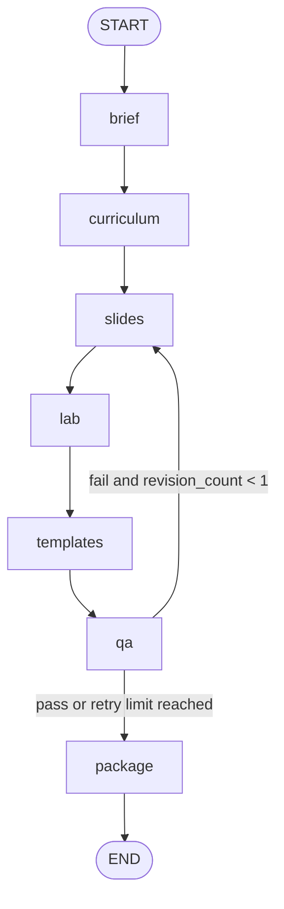

# Training Factory

Training Factory is a LangGraph-based pipeline that generates structured technical training assets from a topic and audience.

Given one input request, it produces a validated bundle with:

- Brief
- Curriculum
- Slides
- Lab
- Templates (`README` + `RUNBOOK`)
- QA report

All major artifacts are schema-validated JSON, which keeps outputs predictable and easy to automate against.

## Features

- Graph-driven orchestration with explicit state transitions
- Bounded QA retry loop (`qa fail` retries once from `slides`)
- Schema-first output validation
- CLI for local generation
- Offline deterministic test path

## CLI Usage

Generate a bundle:

```bash
python -m training_factory generate \
  --topic "Power BI basics" \
  --audience novice
```

Write output to a file:

```bash
python -m training_factory generate \
  --topic "Power BI basics" \
  --audience novice \
  --out out/bundle_powerbi.json
```

Run in offline mode (no external model calls):

```bash
python -m training_factory generate \
  --topic "Power BI basics" \
  --audience novice \
  --offline
```

## Offline Deterministic Tests

The test suite is designed to be deterministic and runnable without network dependencies.

Run tests:

```bash
pytest -q
```

Key guarantees:

- No live model call requirement for tests
- Stable routing and packaging assertions
- Schema validation on final bundle payloads

## Repository Layout

```text
training-factory/
├─ src/training_factory/
│  ├─ agents/           # brief/curriculum/slides/lab/templates/qa agents
│  ├─ graph.py          # LangGraph wiring and routing logic
│  ├─ state.py          # shared pipeline state model
│  ├─ cli.py            # Typer CLI entrypoint
│  └─ utils/            # schema + structured-output helpers
├─ schemas/             # JSON Schemas for artifacts and final bundle
├─ tests/               # routing, smoke, CLI, and utility tests
└─ out/                 # generated bundles (example outputs)
```

## Architecture

Pipeline order:

`START -> brief -> curriculum -> slides -> lab -> templates -> qa -> (slides | package) -> END`

Retry behavior:

- If `qa.status == "fail"` and `revision_count < 1`, route back to `slides`
- Then continue `slides -> lab -> templates -> qa`
- Otherwise route to `package`



## Output Contract

The packaged bundle includes:

- `request`
- `brief`
- `curriculum`
- `slides`
- `lab`
- `templates`
- `qa`

The `templates` payload is canonicalized to:

```json
{
  "readme_md": { "content": "..." },
  "runbook_md": { "content": "..." }
}
```
