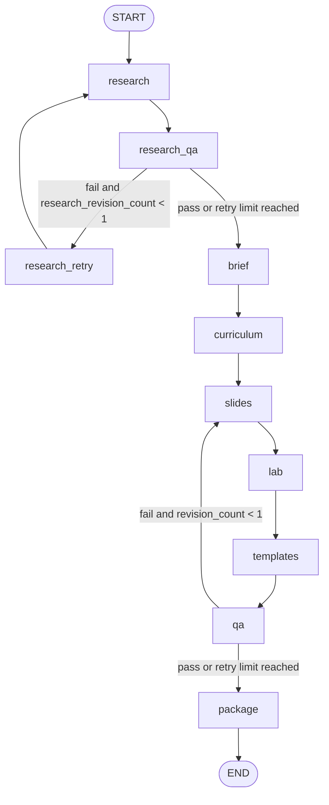

```mermaid
flowchart TD
    START([START]) --> research[research]
    research --> research_qa[research_qa]
    research_qa -->|fail and research_revision_count < 1| research_retry[research_retry]
    research_retry --> research
    research_qa -->|pass or retry limit reached| brief[brief]
    brief --> curriculum[curriculum]
    curriculum --> slides[slides]
    slides --> lab[lab]
    lab --> templates[templates]
    templates --> qa[qa]
    qa -->|fail and revision_count < 1| slides
    qa -->|pass or retry limit reached| package[package]
    package --> END([END])
```
